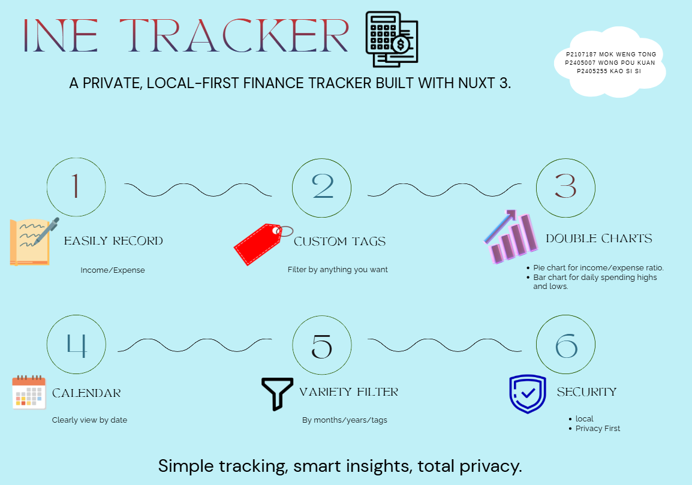
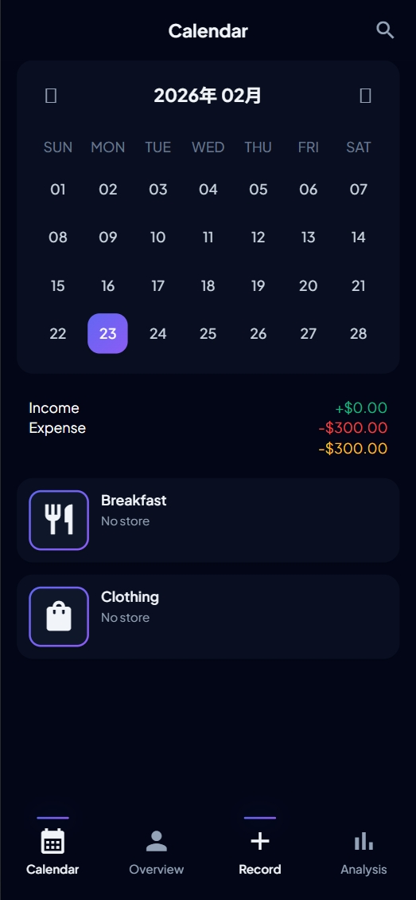
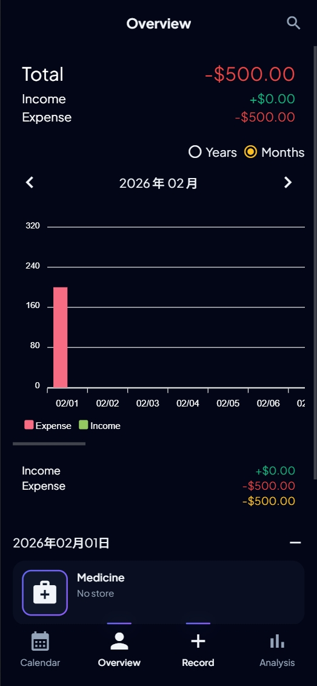
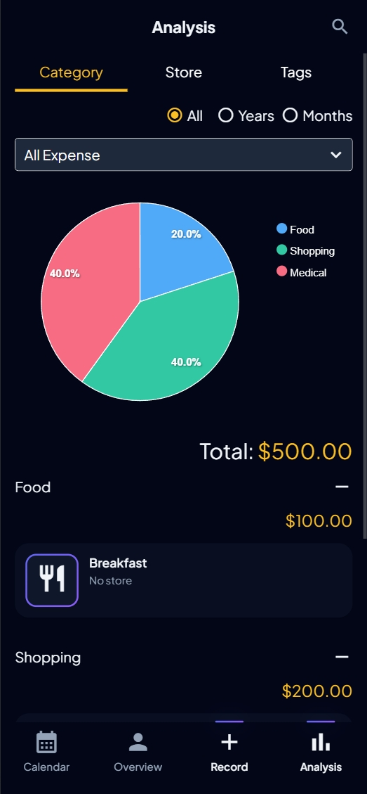
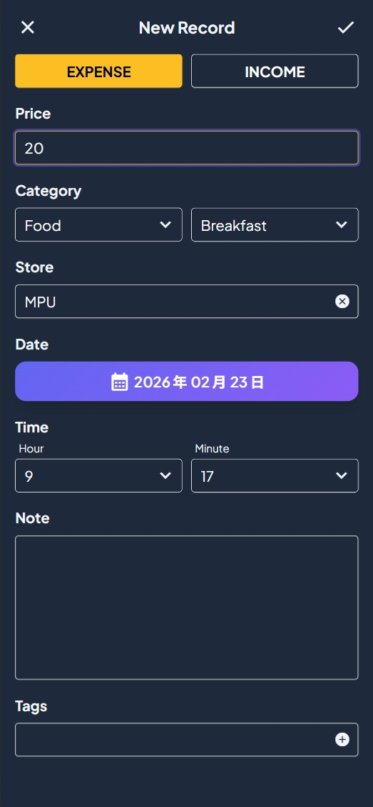

# INE tracker


# General Structure


A modern personal finance tracking application built with Nuxt 3, designed to help you manage income and expenses with an intuitive interface and powerful analytics. Your data stays private with local browser storage.

## Table of Contents

- [Screenshots](#screenshots)
- [Features](#features)
- [Tech Stack](#tech-stack)
- [Installation](#installation)
- [Usage](#usage)
- [Project Structure](#project-structure)
- [Development](#development)
- [Categories](#categories)
- [Roadmap](#roadmap)
- [Contributing](#contributing)
- [License](#license)


## Project Purpose & Development Process

### Purpose

**INE Tracker** is a privacy-first personal finance application that keeps all financial data locally in the user's browser.

- **Target Users**: Privacy-conscious individuals, freelancers, and students who want full control over their financial data.
- **Possible Usage**: Daily expense tracking, monthly budget review, and category‑based spending analysis.

### Team Members & Responsibilities

| Student ID   | Name            | Responsibilities                                              |
| :----------- | :-------------- | :------------------------------------------------------------ |
| P2107187     | MOK WENG TONG   | Software development, architecture design, documentation writing |
| P2405255     | KAO SI SI       | Documentation writing, video text processing |
| P2405007     | WONG POU KUAN   | Video  Editing and capturing proccessing |
### Development Process

- **Selected Model**: Agile (Iterative Development)
- **Reason**: Personal finance requirements often evolve through actual usage. Agile allowed the project to start with a minimal viable product (calendar + basic transaction entry) and incrementally add analytics dashboards, PWA support, and advanced charts based on testing feedback. Waterfall would have required a complete upfront specification, which is unrealistic for a solo‑developed exploratory tool.

### Development Schedule

| Phase                  | Duration   | Key Deliverables                                                       |
| :--------------------- | :--------- | :--------------------------------------------------------------------- |
| Phase 1 – Foundation   | Week 1   | Project scaffolding, Nuxt configuration, IndexedDB schema design        |
| Phase 2 – Core Features| Week 2－3  | Calendar view, add/edit/delete transactions                            |
| Phase 3 – Analytics    | Week 4－5   | ApexCharts integration, Overview and Analysis pages                     |
| Phase 4 – Polish & PWA | Week 6  | PWA support, animations, bug fixes, documentation                       |

### Core Algorithm

- **Data Persistence**: Promise‑based IndexedDB wrapper (`idb-keyval`) performs asynchronous CRUD operations for transaction records.
- **Time‑Range Aggregation**: `Day.js` computes monthly/yearly timestamps; the record store filters records within the range to compute totals and render charts.
- **Category Validation**: `useCategoryValidator` ensures that selected subcategories belong to the correct parent category (e.g., “Breakfast” under “Food”).


## Screenshots

### Calendar View



The main calendar interface for tracking daily transactions

### Overview Dashboard



Dashboard showing comprehensive financial overview

### Analysis - Category Breakdown



Category-based expense analysis with interactive charts

### Add Transaction Modal



Modal form for adding new transactions

## Features


### Core Functionality

- **Calendar-Based Tracking** - Intuitive calendar interface for viewing and adding transactions by date
- **Transaction Management** - Add, edit, and delete income and expense records
- **Smart Categories** - Predefined categories with 60+ subcategories covering all aspects of personal finance
- **Multi-Dimensional Analysis** - Analyze spending by category, store, or tags
- **Flexible Time Periods** - View data for all time, specific years, or specific months
- **Local Storage** - All data stored locally in your browser using IndexedDB for complete privacy

### Analytics & Visualization

- **Interactive Charts** - Powered by ApexCharts for smooth, interactive data visualization
- **Bar Charts** - Compare spending across categories, stores, or tags
- **Pie Charts** - Visual breakdown of expense/income distribution
- **Time-Based Analysis** - Track spending trends over different time periods
- **Real-Time Updates** - Charts update automatically as you add or modify transactions

### User Experience

- **Progressive Web App (PWA)** - Install on your device for offline access
- **Responsive Design** - Works seamlessly on desktop, tablet, and mobile devices
- **Dark Theme** - Easy on the eyes with default dark color scheme
- **Smooth Animations** - Custom CSS animations for polished transitions
- **Quick Actions** - Efficient workflows for common tasks

### Data Management

- **Export Ready** - Data structure supports future export functionality
- **Clear Data Option** - Reset all records with confirmation
- **Privacy First** - No server or cloud storage - your data never leaves your device
- **Offline Capable** - Full functionality without internet connection

## Tech Stack

### Framework & Runtime

| Library                        | Version | Description                                        |
| ------------------------------ | ------- | -------------------------------------------------- |
| [Nuxt](https://nuxt.com/)      | 3.12.4  | Vue 3 Meta Framework for building web applications |
| [Vue](https://vuejs.org/)      | Latest  | Progressive JavaScript framework for building UIs  |
| [Node.js](https://nodejs.org/) | 18+     | JavaScript runtime environment                     |

### Language & Tooling

| Library                                       | Version | Description                                         |
| --------------------------------------------- | ------- | --------------------------------------------------- |
| [TypeScript](https://www.typescriptlang.org/) | 5.0     | Typed superset of JavaScript for safer code         |
| [Vite](https://vitejs.dev/)                   | Latest  | Next-generation frontend tooling for fast builds    |
| [ESLint](https://eslint.org/)                 | 9.19.0  | Find and fix problems in JavaScript/TypeScript code |
| [Prettier](https://prettier.io/)              | 3.3.3   | Opinionated code formatter                          |

### UI & Styling

| Library                                            | Version | Description                                            |
| -------------------------------------------------- | ------- | ------------------------------------------------------ |
| [Tailwind CSS](https://tailwindcss.com/)           | 3.4+    | Utility-first CSS framework for rapid UI development   |
| [SCSS](https://sass-lang.com/)                     | 1.83.4  | CSS preprocessor for custom styles and variables       |
| [Vue3-ApexCharts](https://vue3-apexcharts.js.org/) | 1.5.3   | Vue 3 wrapper for ApexCharts charting library          |
| [ApexCharts](https://apexcharts.com/)              | 3.52.0  | Modern charting library for interactive visualizations |

### State Management & Data

| Library                                                   | Version | Description                                   |
| --------------------------------------------------------- | ------- | --------------------------------------------- |
| [Pinia](https://pinia.vuejs.org/)                         | 2.2.1   | Intuitive, type-safe state management for Vue |
| [@pinia/nuxt](https://pinia.vuejs.org/)                   | 0.4.11  | Pinia integration for Nuxt 3                  |
| [idb-keyval](https://github.com/jakearchibald/idb-keyval) | 6.2.1   | Simple promise-based IndexedDB wrapper        |

### Utilities

| Library                                      | Version | Description                                     |
| -------------------------------------------- | ------- | ----------------------------------------------- |
| [dayjs](https://day.js.org/)                 | 1.x     | Lightweight date/time manipulation library      |
| [dayjs-nuxt](https://dayjs-nuxt.vercel.app/) | 1.2.7   | Day.js integration for Nuxt 3                   |
| [numeral](http://numeraljs.com/)             | 2.0.6   | Library for formatting and manipulating numbers |
| [uuid](https://github.com/uuidjs/uuid)       | 9.0.1   | Generate RFC-compliant UUIDs                    |

### Development Tools

| Library                                                                                        | Version | Description                                  |
| ---------------------------------------------------------------------------------------------- | ------- | -------------------------------------------- |
| [@nuxt/devtools](https://devtools.nuxt.com/)                                                   | 1.3.9   | Developer tools for Nuxt 3                   |
| [@nuxtjs/tailwindcss](https://tailwindcss.nuxtjs.org/)                                         | 6.12.1  | Tailwind CSS integration for Nuxt 3          |
| [@nuxt/eslint-config](https://eslint.nuxt.com/)                                                | 0.7.5   | ESLint configuration for Nuxt projects       |
| [eslint-plugin-simple-import-sort](https://github.com/lydell/eslint-plugin-simple-import-sort) | 12.1.1  | ESLint plugin to auto-sort imports           |
| [vite-plugin-eslint](https://github.com/gdmcbay/vite-plugin-eslint)                            | 1.8.1   | Run ESLint in Vitu for development feedback  |
| [prettier-plugin-tailwindcss](https://github.com/tailwindlabs/prettier-plugin-tailwindcss)     | 0.6.11  | Prettier plugin for sorting Tailwind classes |

### Type Definitions

| Library        | Version  | Description                        |
| -------------- | -------- | ---------------------------------- |
| @types/node    | 18.19.44 | TypeScript definitions for Node.js |
| @types/numeral | 2.0.5    | TypeScript definitions for numeral |
| @types/uuid    | 9.0.8    | TypeScript definitions for uuid    |

## Installation

### Prerequisites

Ensure you have the following installed:

- **Node.js** (v18 or higher recommended)
- **npm**, **yarn**, or **pnpm** package manager

### Install Dependencies

```bash
# Using npm
npm install

# Using yarn
yarn install

# Using pnpm
pnpm install
```

### Environment Setup

This project doesn't require environment variables. All configuration is handled in `nuxt.config.ts`.

## Usage

### Development Mode

Start the development server with hot module replacement:

```bash
npm run dev
```

The application will be available at [http://localhost:3000](http://localhost:3000)

### Production Build

Build the application for production deployment:

```bash
npm run build
```

### Static Site Generation

Generate a static site for deployment:

```bash
npm run generate
```

The output will be in the `.output/public` directory.

### Preview Production Build

Preview the production build locally:

```bash
npm run preview
```

## Project Structure

```
ine-tracker/
├── assets/                      # Static assets
│   ├── data/                    # Static data files
│   │   ├── calendar.json        # Calendar configuration
│   │   └── categories/          # Category definitions
│   │       ├── expense.json     # Expense categories & subcategories
│   │       └── income.json      # Income categories & subcategories
│   ├── images/                  # Image assets
│   ├── scss/                    # SCSS stylesheets
│   │   ├── _animate.scss        # Animation definitions
│   │   ├── _font.scss           # Font configurations
│   │   ├── _mixin.scss          # SCSS mixins
│   │   ├── _reset.scss          # CSS reset
│   │   ├── _variables.scss      # SCSS variables
│   │   └── main.scss            # Main stylesheet entry
│   └── types/                   # TypeScript type definitions
│       ├── analysis.ts          # Analysis-related types
│       ├── categories.ts        # Category-related types
│       ├── chart.ts             # Chart-related types
│       ├── element.ts           # UI element types
│       ├── record.ts            # Transaction record types
│       └── index.ts             # Type exports
│
├── components/                  # Vue components
│   ├── Area/                    # Feature-area components
│   │   ├── Analysis/            # Analysis page components
│   │   ├── Home/                # Home page components
│   │   ├── Overview/            # Overview page components
│   │   ├── Record/              # Transaction record components
│   │   └── Search/              # Search functionality components
│   ├── Card/                    # Card UI components
│   ├── Chart/                   # Chart components (Bar, Pie, Selectors)
│   ├── Form/                    # Form-related components
│   ├── Header/                  # Header components
│   ├── Input/                   # Input components
│   ├── Menu/                    # Menu/navigation components
│   ├── The*.vue                 # Generic/reusable components
│   │   ├── TheAccordion.vue
│   │   ├── TheButton.vue
│   │   ├── TheCalendar.vue
│   │   ├── TheCountor.vue
│   │   ├── TheEmpty.vue
│   │   ├── TheIcon.vue
│   │   ├── ThePopConfirm.vue
│   │   └── ThePopUp.vue
│
├── composables/                 # Vue composables (reusable logic)
│   ├── useCategoryName.ts       # Category name utilities
│   ├── useCategoryValidator.ts  # Category validation
│   ├── useIndexedDB.ts          # IndexedDB operations
│   ├── useRecordForm.ts         # Record form logic
│   ├── useTimeTodayValue.ts     # Today's date utilities
│   └── useTimeValue.ts          # Time value utilities
│
├── layouts/                     # Nuxt layouts
│   └── default.vue              # Default layout wrapper
│
├── pages/                       # File-based routing
│   ├── index.vue                # Calendar view (/)
│   ├── overview.vue             # Overview dashboard (/overview)
│   └── analysis.vue             # Analysis page (/analysis)
│
├── plugins/                     # Nuxt plugins
│   └── apexcharts.client.ts     # ApexCharts client-side plugin
│
├── public/                      # Public static files
│   ├── favicon/                 # Favicon assets
│   └── manifest.json            # PWA manifest
│
├── server/                      # Server-side code
│
├── stores/                      # Pinia stores
│   ├── categoriesStore.ts       # Category state management
│   ├── commonStore.ts           # Common application state
│   └── recordStore.ts           # Transaction record state
│
├── utils/                       # Utility functions
│
├── app.vue                      # Root Vue component
├── nuxt.config.ts               # Nuxt configuration
├── tailwind.config.js           # Tailwind CSS configuration
├── tsconfig.json                # TypeScript configuration
├── package.json                 # Project dependencies
└── README.md                    # This file
```

## Development

### Code Quality

Run ESLint to check code quality:

```bash
npm run lint
```

Format code with Prettier:

```bash
npm run format
```

### Type Checking

This project uses TypeScript for type safety. Type errors will be shown during development and build.

### Adding New Features

1. **New Page**: Create a `.vue` file in the `pages/` directory
2. **New Component**: Add `.vue` files to `components/`
3. **New Composable**: Add `.ts` files to `composables/`
4. **New Store**: Add `.ts` files to `stores/`

### Component Organization

Components are organized by feature areas in `components/Area/`:

- **Area/Analysis** - Analysis page specific components
- **Area/Home** - Calendar view components
- **Area/Overview** - Dashboard components
- **Area/Record** - Transaction record components
- **Area/Search** - Search functionality

## Categories

INE tracker comes with predefined categories for comprehensive financial tracking:

### Expense Categories (9 main categories, 60+ subcategories)

| Category       | Subcategories (examples)                                                 |
| -------------- | ------------------------------------------------------------------------ |
| **Food**       | Breakfast, Lunch, Dinner, Night Snack, Dessert, Drinks                   |
| **Traffic**    | Car, Motorcycle, Bus, Train, Subway, Taxi, Airplane, Ship                |
| **Recreation** | Movies, Exhibitions, Music, Games, Sports, Travel, Amusement Parks       |
| **Shopping**   | Clothing, Shoes, Accessories, Electronics, Daily Items, Cosmetics, Books |
| **Investment** | Stocks, Time Deposits, Funds, Insurance, Cryptocurrency, Real Estate     |
| **Medical**    | Hospital, Dental, Medicine, Surgery, Health Check, Beauty                |
| **Home**       | Water, Electricity, Gas, Internet, Rent, Mortgage, Repairs               |
| **Life**       | Hair, Massage, Parties, Travel, Pets, Weddings, Funerals                 |
| **Learning**   | Tuition, Stationery, Books, Online Courses, Seminars                     |

### Income Categories

Configure your income sources for tracking salary, bonuses, investments, and more.

## Current Status

**Version 2.0.3** is stable and fully functional. All core features are implemented and tested:
- Calendar‑based transaction tracking
- Multi‑dimensional analytics (by category, store, tags)
- PWA installation and full offline support
- Local IndexedDB storage (no server required)

The project is currently in **maintenance and feature expansion** phase.

## Roadmap

### Phase 1 - Data Management (Planned)

- [ ] Export data to CSV/Excel format
- [ ] Import transactions from CSV files
- [ ] Data backup and restore functionality
- [ ] Print reports

### Phase 2 - Enhanced Features (Planned)

- [ ] Multi-currency support
- [ ] Custom category management (add/edit/delete)
- [ ] Budget planning and tracking
- [ ] Recurring transactions
- [ ] Bill reminders
- [ ] Tags management

### Phase 3 - UX Improvements (Planned)

- [ ] Light/Dark mode toggle
- [ ] Customizable themes
- [ ] Multiple language support (i18n)
- [ ] Enhanced mobile experience
- [ ] Keyboard shortcuts

### Phase 4 - Advanced Analytics (Planned)

- [ ] Spending trends over time
- [ ] Budget vs actual comparisons
- [ ] Savings goals tracking
- [ ] Net worth calculator
- [ ] Financial reports generator

## Contributing

Contributions are welcome! Please follow these guidelines:

1. **Fork the repository**
2. **Create your feature branch**: `git checkout -b feature/AmazingFeature`
3. **Commit your changes**: `git commit -m 'Add some AmazingFeature'`
4. **Push to the branch**: `git push origin feature/AmazingFeature`
5. **Open a Pull Request**

### Development Guidelines

- Follow the existing code style (enforced by ESLint and Prettier)
- Write meaningful commit messages
- Ensure all TypeScript types are properly defined
- Test your changes thoroughly
- Update documentation as needed

### Bug Reports

When reporting bugs, please include:

- Steps to reproduce
- Expected behavior
- Actual behavior
- Screenshots if applicable
- Browser/Node version information

## License

This project is licensed under the MIT License - see the [LICENSE.md](LICENSE.md) file for details.

```
The MIT License

Copyright © 2025 WEI-FU CHIOU <waveciou@gmail.com>

Permission is hereby granted, free of charge, to any person obtaining a copy
of this software and associated documentation files (the "Software"), to deal
in the Software without restriction, including without limitation the rights
to use, copy, modify, merge, publish, distribute, sublicense, and/or sell
copies of the Software, and to permit persons to whom the Software is
furnished to do so, subject to the following conditions:

The above copyright notice and this permission notice shall be included in all
copies or substantial portions of the Software.

THE SOFTWARE IS PROVIDED "AS IS", WITHOUT WARRANTY OF ANY KIND, EXPRESS OR
IMPLIED, INCLUDING BUT NOT LIMITED TO THE WARRANTIES OF MERCHANTABILITY,
FITNESS FOR A PARTICULAR PURPOSE AND NONINFRINGEMENT. IN NO EVENT SHALL THE
AUTHORS OR COPYRIGHT HOLDERS BE LIABLE FOR ANY CLAIM, DAMAGES OR OTHER
LIABILITY, WHETHER IN AN ACTION OF CONTRACT, TORT OR OTHERWISE, ARISING FROM,
OUT OF OR IN CONNECTION WITH THE SOFTWARE OR THE USE OR OTHER DEALINGS IN THE
SOFTWARE.
```

## Acknowledgments

- Built with [Nuxt 3](https://nuxt.com/) - The Vue Meta Framework
- Charting powered by [ApexCharts](https://apexcharts.com/)
- Icons from [Material Design Icons](https://fonts.google.com/icons)
- Styled with [Tailwind CSS](https://tailwindcss.com/)
- Data storage via [IndexedDB](https://developer.mozilla.org/en-US/docs/Web/API/IndexedDB_API)
